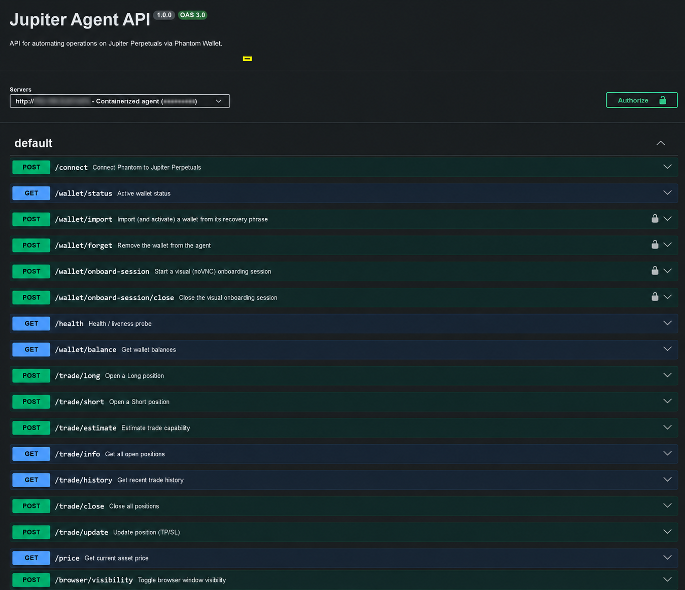
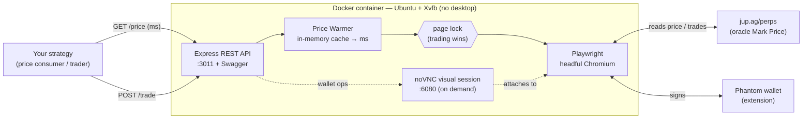

<div align="center">

# PRC Agent Jupiter

**RPA-as-a-service that trades and reads prices directly from the public [Jupiter Perpetuals](https://jup.ag/perps) interface — capturing the *real oracle* mark price with ~45× more accuracy than the public v3 API, and executing automated trades when external feeds can't be trusted.**

[](LICENSE)


</div>

> When you don't control the resources of the system you operate on, a well-built RPA is the only source that sees *exactly what the market sees*. This project demonstrates, **with data**, that the difference translates into faster, more accurate decisions — and in markets, that is an edge.



*The agent exposes a full REST API (interactive Swagger at `/api-docs`): price, trading, and X-API-Key-protected wallet management.*

---

## Table of contents

- [The problem](#the-problem)
- [The solution: RPA as a service](#the-solution-rpa-as-a-service)
- [Measured result: accuracy](#measured-result-accuracy)
- [Why it matters: the competitive edge](#why-it-matters-the-competitive-edge)
- [How it works (architecture)](#how-it-works-architecture)
- [Quick start](#quick-start)
- [API overview](#api-overview)
- [Wallet management & visual onboarding](#wallet-management--visual-onboarding)
- [Reproduce the accuracy audit](#reproduce-the-accuracy-audit)
- [Project structure](#project-structure)
- [Roadmap](#roadmap)
- [Security](#security)
- [Disclaimer](#disclaimer)

---

## The problem

Trading on a platform you **don't own** leaves you two poor options to feed your decisions:

1. **Its public APIs.** For Jupiter, the *Price API v3* returns the **spot price of the wrapped token** (e.g. wBTC on Solana), not the **oracle mark price** that actually governs the perpetuals — the one that drives your entries, your PnL and your liquidations. That spot price **drifts systematically** from the oracle.
2. **External oracles / third-party aggregators.** Useful, but they add latency, another trust surface, and again **don't necessarily match what the platform uses internally**.

The result: if you make perps decisions on a feed that isn't the real mark, you trade with a constant bias. A *directional* bias — not random noise — is the worst thing for a strategy, because it **doesn't average to zero**: it shifts *every* trade in the same direction.

## The solution: RPA as a service

Instead of guessing the price from the outside, the agent **reads it exactly where a human reads it**: the Jupiter Perpetuals interface itself, rendered in a real browser driven by automation (Playwright + headful Chromium with the Phantom wallet loaded as an extension).

This turns the public UI — something you **don't control** — into a **reliable, operable source of truth**:

- 🎯 **Reads the oracle mark price** exactly as the platform shows it (not an external proxy).
- ⚡ **Serves it over REST in milliseconds**, from an in-memory cache that never locks the page.
- 🤖 **Executes real operations** (open/close/modify positions, TP/SL) by signing with the wallet, just like a person would.

This is **RPA (Robotic Process Automation) as a service**: it automates the human process of "watch the screen and trade" on a system whose resources you don't own, and exposes it as a reliable internal service.

> **The thesis, generalized:** when a system's best source of truth lives in its interface, a well-built RPA can turn that interface into a private API of *higher quality* than the provider's own public API.

## Measured result: accuracy

We audited the agent's price against two references over **1 hour (639 samples, 5 s interval, WBTC market)**, using the **Pyth oracle as the benchmark** — the oracle family Jupiter Perps derives its mark from, making it the apples-to-apples reference.

**Results at a glance:** the agent tracks the real oracle within **~1.5 bps 95% of the time, with zero bias**, while the public v3 API carries a **constant +16 bps directional error**.

| \|abs\| error vs oracle | **Agent (UI)** | **v3 API** | Agent advantage |
|---|:---:|:---:|:---:|
| mean | **0.36 bps** | 16.05 bps | **44.8× more accurate** |
| median (p50) | 0.18 bps | 15.02 bps | ~83× |
| **p95** | **1.52 bps** | 28.21 bps | **18.6× more accurate** |
| max | 3.23 bps | 33.77 bps | ~10× |
| **bias** (signed) | **+0.06 bps** *(none)* | **+16.13 bps** *(systematic)* | — |
| within ≤ 5 bps | **100%** | 3.3% | — |

<sub>1 bp = 0.01%. Cache freshness during the run: median **527 ms**, **0%** of reads flagged stale, and **no correlation** between staleness and error (Pearson −0.06).</sub>

**Why this is even worse for v3 than the headline suggests:** the v3 error is **bias, not noise**. A constant +16 bps offset shifts *every* entry and exit in the same direction — it never averages out. The agent's error, by contrast, is tiny symmetric noise centered on the real mark.

> The method is fully reproducible and lives in [`audit/`](audit/README.md). The "~45× more accurate" claim is **measurable, not marketing**.

## Why it matters: the competitive edge

In trading, edge compounds as **accuracy × speed**:

- **Accuracy** → better statistics → cleaner signals → higher probability of getting the prediction right.
- **Speed** → the price is served from an in-memory cache in **milliseconds**, without locking the page, so your strategy decides and acts sooner.

A competitor deciding on the **real mark** in **less time** operates with a structural advantage over one using a biased or slow feed. Trade after trade, that advantage compounds into **higher win rates**.

## How it works (architecture)



Key pieces (in [`src/`](src/)):

| File | Responsibility |
|---|---|
| `index.ts` | REST API (Express): price, trading, balance, wallet management, health, Swagger at `/api-docs`, permissive CORS so browser clients work. |
| `jupiter.ts` | The **price warmer** — a background loop that keeps a price cache hot by reading the UI *Mark Price*, so `GET /price` answers in **ms without touching the browser**. Includes `getCurrentMarket()` (parses `SOL-<MARKET>` from the URL) and a *maintenance mode* that pauses the warmer during wallet ops. |
| `browser.ts` | Browser lifecycle (cross-platform; profile-lock cleanup, launch retries). |
| `phantom.ts` | Phantom wallet automation (import/activate, unlock). |
| `vnc.ts` | On-demand **noVNC** session for wallet onboarding (Phantom's MV3 popups don't render reliably headless). |
| `mutex.ts` | A *page lock* so the warmer and trading never fight over the browser — **trading always wins**. |

**Design constraint:** the browser uses **at most two tabs** (Jupiter + Phantom). The price is **always** read from the interface, never from an external API — that is precisely the reason for its accuracy.

## Quick start

Runs **isolated in Docker** on Linux (no VT-x required: Linux containers use namespaces/cgroups). Headful Chromium runs under `Xvfb` (a virtual display).

```bash
git clone https://github.com/Zeus555/Agent-Jupiter.git
cd Agent-Jupiter

cp .env.example .env          # set PHANTOM_PASSWORD, WALLET_API_KEY, etc.
docker compose up -d --build  # API on :3011, Swagger on :3011/api-docs
```

For a fresh host, [`deploy/setup-ubuntu.sh`](deploy/setup-ubuntu.sh) installs Docker + compose, creates swap and brings the service up. Full guide in [`DOCKER.md`](DOCKER.md).

```bash
# Smoke test
curl "http://localhost:3011/price?asset=WBTC"
# → {"price":"$66012.36","asset":"WBTC","ageMs":398,"stale":false,"durationMs":14}
```

## API overview

Full interactive docs at **`/api-docs`** (Swagger). Main endpoints:

| Method | Path | Description |
|---|---|---|
| `GET` | `/price?asset=WBTC` | Oracle mark price (from cache, with `ageMs`/`stale`) |
| `GET` | `/wallet/balance` | Wallet balances |
| `POST` | `/trade/long` · `/trade/short` | Open a position |
| `POST` | `/trade/close` | Close positions |
| `POST` | `/trade/update` | Modify TP/SL |
| `GET` | `/trade/estimate` · `/trade/info` · `/trade/history` | Estimate / open positions / history |
| `GET` | `/wallet/status` | Active wallet and connection state |
| `POST` | `/wallet/import` · `/wallet/forget` | Change / remove wallet 🔒 |
| `POST` | `/wallet/onboard-session[/close]` | Visual noVNC session to create/connect a wallet 🔒 |
| `GET` | `/health` | Liveness + warmer status |

🔒 = protected with `X-API-Key` (fail-closed).

## Wallet management & visual onboarding

Phantom's onboarding/approval popups (MV3) don't render reliably under headless automation, so the wallet is connected once through an **on-demand visual session**:

1. `POST /wallet/onboard-session` (with `X-API-Key`) → returns a **noVNC URL** + a one-time password.
2. Open it in your browser, connect/import the wallet in Phantom **by hand**.
3. `POST /wallet/onboard-session/close` → resumes the price warmer.

From then on, the agent **reconnects on its own** after restarts (Jupiter stays a trusted app in Phantom). Wallets can be swapped on demand via `/wallet/import` (deterministic) or a new visual session.

<!-- TODO: drop a recorded walkthrough of the noVNC onboarding at docs/onboarding.gif and embed it here -->

## Reproduce the accuracy audit

The full harness lives in [`audit/`](audit/):

```bash
# Sample agent vs Jupiter v3 vs Pyth (oracle) — one JSONL line per sample
AGENT_URL=http://localhost:3011 ./node_modules/.bin/tsx audit/price-audit.ts

# Generate the report (p50/p90/p95/p99, bias, % within tolerance, freshness, availability)
./node_modules/.bin/tsx audit/analyze.ts
```

## Project structure

```
src/            Agent: API, price warmer, browser/wallet automation
audit/          Reproducible price-accuracy harness (sampler + analyzer)
deploy/         Ubuntu bare-metal / Docker setup script
extensions/     Phantom wallet extension (loaded into Chromium)
docs/           Documentation assets
Dockerfile · docker-compose.yml · swagger.yaml · DOCKER.md
```

## Roadmap

- [ ] Continuous **price-health guardrail**: always-on oracle cross-check that alarms when UI↔oracle divergence exceeds tolerance, with the latest bps exposed on `/health`.
- [ ] Recorded **noVNC onboarding walkthrough** (GIF) in the README.
- [ ] Multi-market audit (SOL, ETH) with per-market oracle references.
- [ ] Optional Prometheus/Grafana metrics for latency and accuracy.
- [ ] Hardened multi-wallet management.

## Security

- Recovery phrases are **never** logged or returned. The seed, if generated, is stored with `0600` permissions and outside the repo.
- Secrets (`.env`), wallet state (`user_data/`), seeds and screenshots are in `.gitignore` — **verify nothing sensitive is staged before publishing**.
- Wallet-mutating endpoints require `X-API-Key`.

## Disclaimer

Software for educational and research purposes in automation (RPA) and for use on your own accounts. Automated trading carries **real financial risk**; using third-party interfaces may be subject to their Terms of Service. Use at your own risk.

---

<div align="center">

**Stack:** TypeScript · Node · Express · Playwright · Docker · Solana / Jupiter Perpetuals · Phantom
Licensed under [MIT](LICENSE).

</div>
